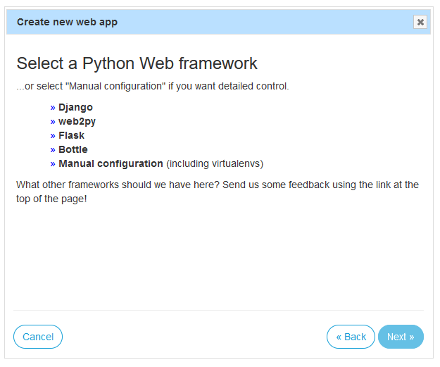
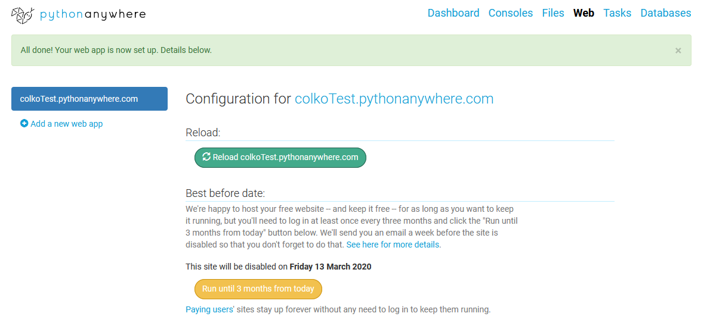
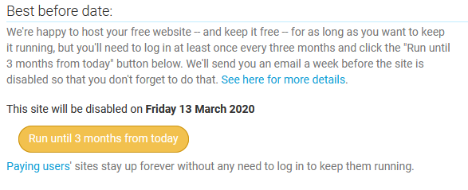
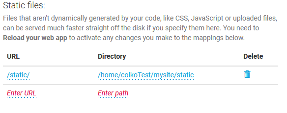
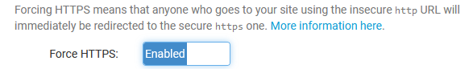
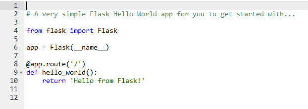
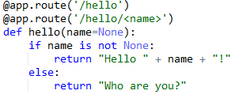
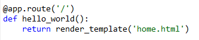
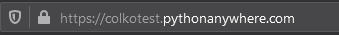
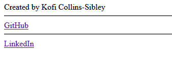

# How to run a Flask website using Pythonanywhere

## Flask

Flask is a free python web hosting framework. What that means is it's a tool that allows you to create a website quickly and easily using python, html, and javascript.

More information on flask can be found on its [website](https://palletsprojects.com/p/flask/).

## How to create a Flask app on Pythonanywhere

1. Log into [pythonanywhere.com](pythonanywhere.com) and navigate to the `Web` tab. Click `Add a new web app`

2. The free version of pythonanywhere does not allow setting your website's URL unfortunately, so just click `Next` when asked to change the URL/domain name.
3. Select `Flask` as your python web framework and click `Next`

4. Select the latest version of python, currently this is `Python 3.8`
5. No need to change the application file name so just click `Next`
6. You should now see your website's dashboard. Ta-da! You now have your own website.

### Pythonanywhere's web dashboard

The web dashboard allows you to control and administer your website. Here are some important things to pay attention to:
* `Best before date` | Because pythonanywhere is free, your site has an expiation date. Fear not because all you have to do to keep your site live is come back to this dashboard every 3 months to refresh your lease.

* `Static files` | Pythonanywhere required you to configure where your `static` directory is. We'll learn more about static files later on. What's important now is to configure a static directory in you site's directory.

* `Security` / `HTTPS` | Here you have some security options. You can secure your site so that only someone with a username and password can access it. **IMPORTANT:** There is a toggle button in this section labeled `Force HTTPS`. Enabling this will force all traffic to and from your website to be secured by encryption. This is _extremely_ important if you ever put personal information on this website. If HTTPS / passwords are not enabled, anyone on the internet can access your information.

### Flask

Simple flask application generated by pythonanywhere:

Try navigating to your website `<your-domain>.pythonanywhere.com` on you computer or phone and see the results!

#### APIs

API stands for `Application programming interface` or "how a human interacts with a computer application". API can refer to many different types of application, but in this instance it reference to web addresses.

Web APIs can return HTML rendered websites, raw data, or more code (javascript).

##### Example

This is an example of a simple API:

#### HTML

Flask also allows for rendering HTML webpages. We can talk more about HTML later, for now here is a simple example:

